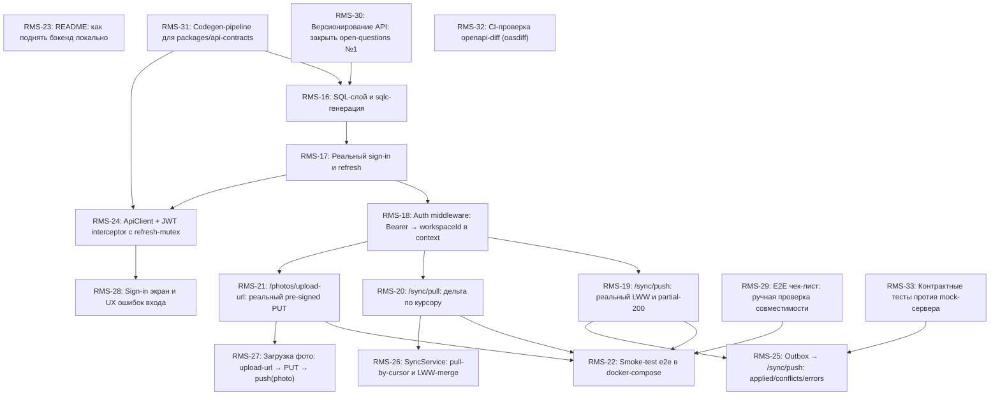

# Зависимости задач в Linear

Схема связей (blocking / blocked by) текущих открытых задач из Linear:

```mermaid
graph TD
    %% Определения задач с полными русскими названиями
    RMS-16["RMS-16: SQL-слой и sqlc-генерация"]
    RMS-17["RMS-17: Реальный sign-in и refresh"]
    RMS-18["RMS-18: Auth middleware: Bearer → workspaceId в context"]
    RMS-19["RMS-19: /sync/push: реальный LWW и partial-200"]
    RMS-20["RMS-20: /sync/pull: дельта по курсору"]
    RMS-21["RMS-21: /photos/upload-url: реальный pre-signed PUT"]
    RMS-22["RMS-22: Smoke-test e2e в docker-compose"]
    RMS-23["RMS-23: README: как поднять бэкенд локально"]
    RMS-24["RMS-24: ApiClient + JWT interceptor с refresh-mutex"]
    RMS-25["RMS-25: Outbox → /sync/push: applied/conflicts/errors"]
    RMS-26["RMS-26: SyncService: pull-by-cursor и LWW-merge"]
    RMS-27["RMS-27: Загрузка фото: upload-url → PUT → push(photo)"]
    RMS-28["RMS-28: Sign-in экран и UX ошибок входа"]
    RMS-29["RMS-29: E2E чек-лист: ручная проверка совместимости"]
    RMS-30["RMS-30: Версионирование API: закрыть open-questions №1"]
    RMS-31["RMS-31: Codegen-pipeline для packages/api-contracts"]
    RMS-32["RMS-32: CI-проверка openapi-diff (oasdiff)"]
    RMS-33["RMS-33: Контрактные тесты против mock-сервера"]

    %% Корневые блокировщики
    RMS-30 --> RMS-16
    RMS-31 --> RMS-16
    RMS-31 --> RMS-24
    RMS-29 --> RMS-22
    RMS-33 --> RMS-25

    %% Основная цепочка бэкенда и авторизации
    RMS-16 --> RMS-17
    RMS-17 --> RMS-18
    RMS-17 --> RMS-24
    RMS-18 --> RMS-19
    RMS-18 --> RMS-20
    RMS-18 --> RMS-21
    RMS-24 --> RMS-28

    %% Ветвь синхронизации и данных
    RMS-19 --> RMS-22
    RMS-19 --> RMS-25
    RMS-20 --> RMS-22
    RMS-20 --> RMS-26
    RMS-21 --> RMS-22
    RMS-21 --> RMS-27
```
